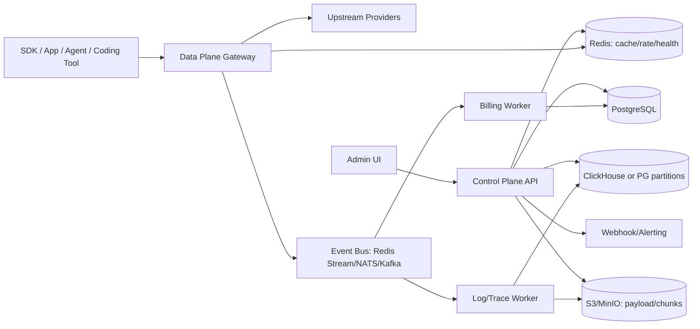
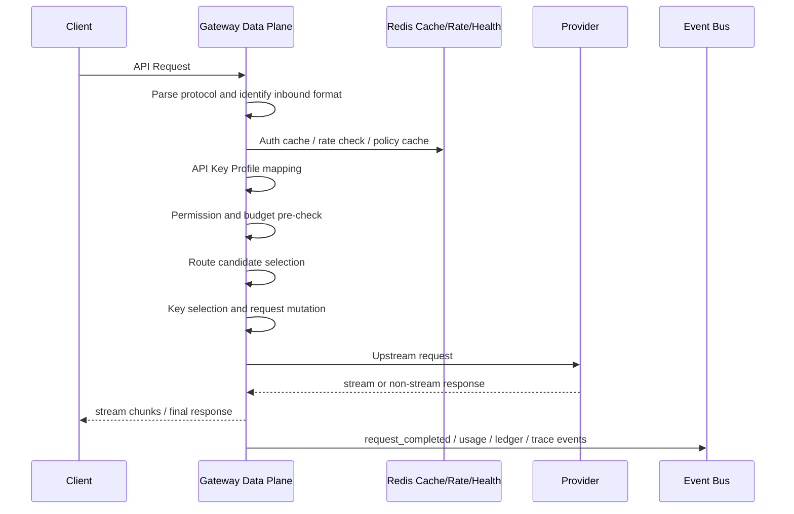
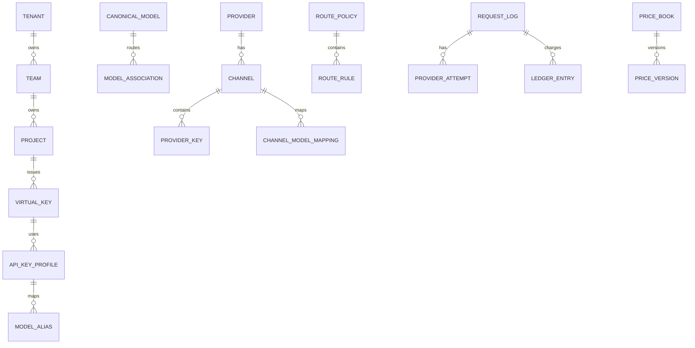

# 架构规划：生产级 AI Gateway / New API 替代产品

版本：0.1-dev-start  
日期：2026-06-01

## 1. 架构目标

本系统要同时满足三类场景：

1. **New API / One API 用户迁移**：需要多渠道、模型映射、额度、用户 Key、后台、日志、价格和分组能力。
2. **企业内部 AI Gateway**：需要团队、项目、预算、RBAC、SSO、审计、观测、数据策略和私有化部署。
3. **开发者 / Agent / Coding 工具入口**：需要 OpenAI、Anthropic、Gemini、Responses、流式 SSE、工具调用和 Trace 聚合。

架构必须把“管理后台”和“请求转发热路径”分离，避免后台复杂度影响生产请求稳定性。

## 2. 总体架构

采用 **Control Plane + Data Plane + Event/Observability Plane**。



### 2.1 Control Plane

Control Plane 负责慢路径和配置管理：

| 模块 | 职责 |
|---|---|
| Tenant / Team / User | 多租户、团队、成员、角色、项目归属 |
| Auth / RBAC / SSO | 登录、OIDC/SAML、API Key、权限、审计 |
| Provider / Channel | 上游供应商、渠道、Key 池、区域、标签、限额 |
| Model Catalog | Canonical Model、能力标签、上下文、价格、可见性 |
| API Key Profile | 客户端模型名映射、模型权限、渠道 tag 限制、默认策略 |
| Route Policy | 候选渠道、排序、fallback graph、canary、BYOK 优先 |
| Price Book | 模型价格、token 类型、cache/reasoning/image/audio/tool 价格 |
| Ledger | 预授权、冻结、结算、退款、调账、审计 |
| Observability UI | Trace、Request、日志、成本、健康、路由解释 |
| Migration | New API / One API / AxonHub 配置导入和差异检查 |
| Ops | 告警、备份、清理任务、配置导出、健康检查 |

### 2.2 Data Plane

Data Plane 负责请求热路径：



Data Plane 必须满足：

- 无状态，可水平扩展。
- 热路径不依赖慢查询；配置、价格、模型、路由策略进入 Redis + 本地缓存。
- 请求开始前做轻量预授权，最终账务由异步 worker 结算，但账务事件不能丢。
- Streaming 是一等场景，必须支持 backpressure、partial_sent、terminal event、stream_end_reason。
- Adapter 不能污染核心 pipeline，所有 provider 差异通过 adapter、request mutation、protocol transformer 处理。

### 2.3 Event / Observability Plane

异步事件用于解耦请求链路：

| 事件 | 生产者 | 消费者 | 说明 |
|---|---|---|---|
| `request.started` | Data Plane | Trace Worker | 请求开始、身份、模型、profile |
| `route.decided` | Data Plane | Trace Worker | 候选渠道、过滤原因、选择结果 |
| `provider.attempted` | Data Plane | Trace Worker / Health Worker | 每次上游尝试、key、timeout |
| `stream.chunked` | Data Plane | Trace Worker | 可选采样，不默认全量 |
| `request.completed` | Data Plane | Billing / Log Worker | usage、latency、end reason |
| `request.failed` | Data Plane | Billing / Health / Alert | error taxonomy、retryable、partial_sent |
| `ledger.settle_requested` | Billing Worker | Ledger | 结算请求 |
| `health.updated` | Health Worker | Redis / PG | provider/channel/key/model 健康状态 |
| `audit.logged` | Control Plane | Audit Store | 管理操作留痕 |

事件必须有 `event_id` 和幂等键，避免重复结算。

## 3. 推荐技术栈

| 层 | 推荐 | 说明 |
|---|---|---|
| 后端语言 | Rust 优先；P0/P1 默认 Data Plane、Worker、Control Plane 统一 Rust | 面向极致优化，优先压低内存占用、稳定 streaming 尾延迟 |
| HTTP 框架 | Axum + Hyper + Tower | 数据面与控制面共享中间件模型，兼顾高性能和可维护性 |
| 异步运行时 | Tokio | 适合高并发长连接、SSE、backpressure 和细粒度超时控制 |
| TLS | rustls | 减少跨平台系统库差异，避免 Linux/OpenSSL 与 Windows/macOS 系统 TLS 分叉 |
| 数据访问 | SQLx（P0 优先）或 SeaORM（P1 可评估） | P0 优先直接 SQL 和显式事务，避免热路径 ORM 抽象开销 |
| 数据库 | PostgreSQL 优先，MySQL 兼容 P1 | 账务、配置、审计需要事务能力 |
| 缓存/限流 | Redis | 配置缓存、rate limit、health、分布式锁 |
| 日志/Trace | P0: PostgreSQL 分区；P1: ClickHouse + OTLP | 不建议千万日志压普通业务表 |
| 对象存储 | S3/MinIO/GCS | 原始 payload、SSE chunk 采样、大响应体 |
| 前端 | React + TypeScript | 管理后台、Trace Viewer、配置编辑器 |
| 部署 | Docker Compose + Helm | 单机和 K8s 双形态 |
| CI/CD | GitHub Actions/GitLab CI | test、lint、scan、build、e2e、image sign |
| 可观测 | OpenTelemetry + Prometheus | 标准化输出到企业现有平台 |

Rust-first 落地约束：

- P0 生产部署只承诺 Linux 容器目标：`x86_64` 与 `arm64`。
- 本地开发可支持 Windows/macOS/Linux，但不得把平台特化逻辑写进热路径。
- 所有出站 HTTPS 默认走 `rustls`，禁止在 P0 热路径依赖 `native-tls` / OpenSSL 系统差异。

## 4. 关键领域模型



核心分层：

```text
Client Model Name
  -> API Key Profile alias mapping
  -> Canonical Model ID
  -> Model Association / Route Policy
  -> Channel / Provider Key
  -> Upstream Model Name
```

## 5. 请求处理 Pipeline

### 5.1 非流式请求

1. 接收请求，识别 inbound protocol：OpenAI Chat、OpenAI Responses、Anthropic Messages、Gemini GenerateContent、自定义 OpenAI-compatible。
2. 生成 `request_id`、读取或生成 `trace_id`、`thread_id`。
3. 鉴权：Virtual Key / OIDC token / internal token。
4. 读取 API Key Profile：模型别名、可访问模型、允许渠道 tag、payload policy。
5. 协议预解析：只抽取路由和账务需要的最小字段，不丢原始 body。
6. Canonical Model 解析：客户端模型名映射为平台内部模型。
7. 权限校验：模型白名单、渠道 tag、项目权限、IP、过期时间。
8. 限流和预算预检查：RPM、TPM、并发、daily/monthly budget、wallet/subscription。
9. 候选渠道生成：按 Model Association、Route Policy、健康、key 状态过滤。
10. 路由排序：priority、weight、latency、cost、health、BYOK、quota、session affinity。
11. Provider attempt：request mutation、header injection、model name mapping、调用上游。
12. 错误处理：按 taxonomy 判断 retry/fallback/circuit breaker。
13. 响应转换：按客户端协议返回。
14. Usage extraction：token、cache、reasoning、image/audio/tool/task 用量。
15. Ledger settle：异步或同步确认结算。
16. Log/Trace 写入：route decision、provider attempt、usage、cost、error。

### 5.2 流式请求

流式请求特殊要求：

- 只有 **first byte / first chunk 之前** 的失败才能安全 fallback。
- 一旦 `partial_sent=true`，禁止无脑切换 provider，否则会造成重复内容或协议损坏。
- stream engine 必须记录 `stream_end_reason`：`completed`、`client_cancel`、`upstream_eof`、`upstream_error`、`parser_error`、`timeout`、`gateway_abort`。
- 每种协议必须有 terminal event conformance：OpenAI `[DONE]`、Responses `response.completed`、Anthropic `message_stop`、Gemini end candidates 等。

## 6. 模块边界

| 模块 | 不能做什么 | 必须暴露什么 |
|---|---|---|
| Auth | 不直接查复杂账务 | identity、project、tenant、key profile |
| Routing | 不调用数据库慢查询 | route decision、filtered reasons、candidate scores |
| Adapter | 不做账务扣费 | normalized usage、provider errors、raw event hints |
| Billing | 不选择 provider | preauth/reserve/settle/refund API |
| Stream Engine | 不理解商业计费规则 | chunks、terminal、usage event、partial_sent |
| Observability | 不阻塞主请求 | trace/span/log async ingest |
| Admin UI | 不承担后端校验 | schema-driven form + dry-run |

## 7. 高可用设计

P0 最低生产形态：

```text
2+ Data Plane instances
2+ Control Plane instances or same binary multi-instance
PostgreSQL managed or primary-replica
Redis managed with persistence
Object storage optional but recommended
```

P0 SLO 建议：

| 指标 | 目标 |
|---|---|
| Gateway 自身可用性 | 99.9% |
| 非流式网关额外 P95 延迟 | < 50ms，不含上游耗时 |
| 流式 TTFT 额外 P95 | < 100ms，不含上游耗时 |
| 请求日志写入丢失率 | < 0.01%，可通过重试补偿 |
| 账务事件丢失率 | 0，必须幂等和可恢复 |
| 单实例并发流 | P0 目标 1,000，P1 目标 5,000+ |

## 8. 关键架构决策

### ADR-001：PostgreSQL 作为账务和配置主库

原因：账务、配置、审计需要事务、约束、索引和可恢复性。SQLite 仅用于本地 demo。

### ADR-002：协议转换必须保留 Raw Layer

原因：AxonHub 暴露出 Responses / MCP / Codex 场景中字段被压扁后丢失的问题。系统必须区分 Raw Request、Normalized Semantic Event、Target Protocol Event。

### ADR-003：日志/Trace 与账务分离

原因：日志可能被清理、降采样或迁移；账务不能依赖日志存在。Ledger 是财务事实来源。

### ADR-004：Data Plane 不直接依赖 Admin UI schema

原因：导入、API 操作、脚本和未来 IaC 可能绕过 UI，后端必须自带完整配置校验。

### ADR-005：所有 provider adapter 必须有 Conformance Tests

原因：协议兼容不是靠人工验证。每个 adapter 必须通过 chat、stream、tool、usage、error、terminal event fixtures。
