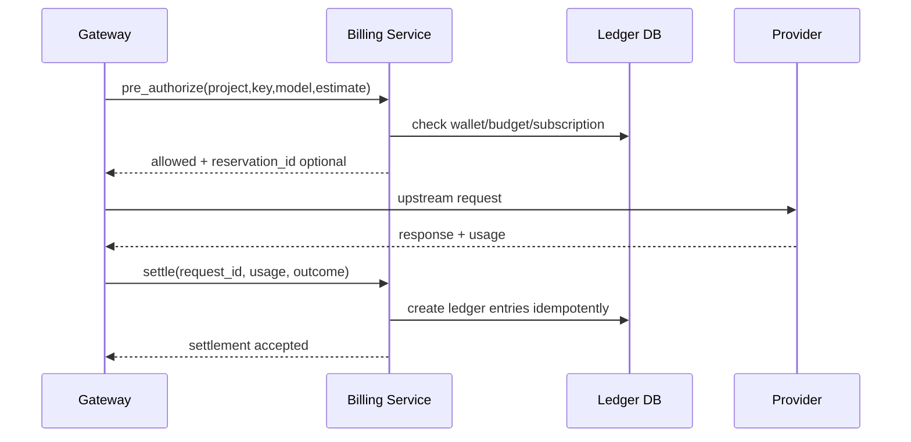

# 账务 Ledger 与成本结算规格

版本：0.1-dev-start  
日期：2026-06-01

## 1. 设计目标

New API 类系统常见风险是把余额扣减、模型倍率、订阅、分组权限和日志统计混在请求逻辑中。本系统必须把账务设计为独立 Ledger：

- 每笔扣费可追溯到 request_id、trace_id、price_version、usage_snapshot。
- 历史账单不受后续价格变更影响。
- 失败、部分失败、客户端取消、缓存命中有明确结算策略。
- 账务事件幂等，不重复扣费。
- Dashboard 聚合不是财务事实，Ledger 才是事实来源。

## 2. 账务对象

| 对象 | 说明 |
|---|---|
| Wallet | 用户/团队/项目余额账户 |
| Credit Grant | 赠送额度、试用额度，有有效期和适用范围 |
| Subscription | 订阅计划，有模型/分组/额度规则 |
| Budget | 项目、Key、团队维度预算，不一定等于余额 |
| Price Book | 价格表 |
| Price Version | 价格版本，不覆盖历史 |
| Rating Engine | 根据 usage 和价格计算费用 |
| Ledger Entry | 账务流水，reserve/settle/refund/adjust/expire |
| Invoice Item | P1/P2，用于发票或账单展示 |

## 3. 计费流程



## 4. P0 结算规则

| 场景 | 结算策略 |
|---|---|
| 非流式成功，有 usage | 按实际 usage 结算 |
| 非流式成功，无 usage | 使用 tokenizer 估算，标记 estimated=true |
| 流式成功，有 usage | 按实际 usage 结算 |
| 流式成功，无 usage | 输出 token 可估算，输入 token 预估，标记 estimated=true |
| 首 chunk 前失败 | 不扣或退回 reserve |
| 已 partial_sent 后失败 | 可按已输出估算结算，策略可配置 |
| client_cancel 未输出 | 不扣或仅扣固定网关费，P0 默认不扣 |
| client_cancel 已输出 | 按已输出估算，策略可配置 |
| provider 认证失败 | 不扣用户费用，记录 provider/key health |
| policy/billing 拒绝 | 不调用上游，不扣费 |
| cache hit | P1：按 0、固定价或折扣价结算 |

## 5. Price Book

### 支持 token 类型

- input tokens。
- output tokens。
- cache read tokens。
- cache write tokens。
- reasoning tokens。
- image units。
- audio seconds。
- rerank units。
- tool/task units，P1/P2。

### Pricing Modes

| 模式 | P0/P1 | 说明 |
|---|---|---|
| usage_per_unit | P0 | 每 1K/1M tokens 单价 |
| flat_fee | P0 | 每请求固定价 |
| tiered_by_volume | P1 | 阶梯计费 |
| tiered_by_context | P1 | 按上下文长度改变价格 |
| custom_formula | P2 | 受控 DSL，不直接执行任意代码 |

## 6. Ledger Entry

字段：

```json
{
  "entry_type": "reserve|settle|refund|adjust|expire",
  "amount": "-0.012300",
  "currency": "USD_OR_CREDIT",
  "request_id": "req_x",
  "trace_id": "trace_x",
  "project_id": "proj_x",
  "virtual_key_id": "vk_x",
  "price_version_id": "pv_x",
  "usage_snapshot": {},
  "policy_snapshot": {},
  "idempotency_key": "settle:req_x:attempt_1",
  "status": "confirmed"
}
```

## 7. 幂等要求

- `pre_authorize` 可以多次调用，不应重复冻结。
- `settle(request_id)` 多次调用只产生一次最终结算。
- refund 必须引用原 ledger entry。
- 账务 worker 崩溃后可从事件队列重放。

## 8. 对账

每日对账任务：

1. 汇总 `request_logs` usage。
2. 汇总 `ledger_entries` settle/refund。
3. 按 tenant/project/model/provider 比较差异。
4. 生成 reconciliation report。
5. 差异超过阈值告警。

## 9. 验收

- 修改价格后，历史请求详情仍显示旧 price_version。
- 同一个 request_id 重放 settle 事件，不重复扣费。
- provider 500 首 chunk 前失败，用户不扣费。
- stream 已输出后中断，按策略生成部分费用并标记 estimated。
- 预算不足请求在调用上游前被拒绝。
- ledger 和 dashboard 日报差异低于 0.1%，差异可追踪。
